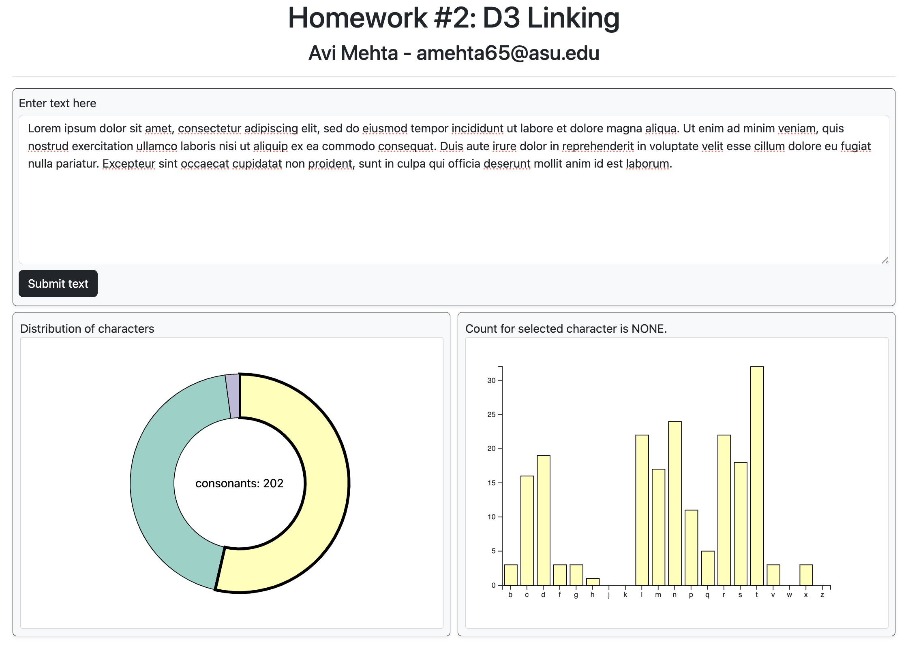
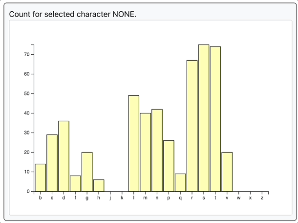
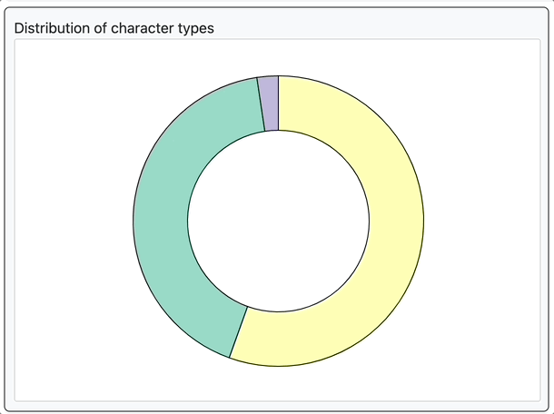

# Alphabet Distribution Visualizer

This project presents an interactive data visualization using D3.js, focusing on dynamically linking a donut chart and a bar chart based on user-input text data. Users can input text, and the application visualizes the distribution and count of characters (vowels, consonants, punctuation) in the form of interactive charts.

## Overview






## Features

- **Interactive Donut Chart**: Visualizes the distribution of character types (vowels, consonants, punctuation) in the input text.
- **Linked Bar Chart**: Displays the count of specific characters when a segment in the donut chart is clicked.
- **Dynamic Data Processing**: Parses user-input text to count and categorize each character.
- **Hover Tooltip**: Provides detailed information about specific characters in the bar chart.
- **Interactive Label Updates**: The label dynamically updates to show counts for the character currently hovered over in the bar chart.
- **Responsive Design**: The charts and tooltip respond to user interaction, offering a dynamic and engaging experience.

## Technologies

- **D3.js**: For creating interactive data visualizations.
- **HTML/CSS**: For structuring and styling the webpage.
- **JavaScript**: Handling data processing and dynamic updates based on user interaction.
- **Bootstrap**: For styling and responsive design elements.

## Getting Started

1. **Clone the Repository**: Clone or download the project repository to your local machine.
    ```
    git clone <repository-url>
    ```

2. **Open `index.html`**: Navigate to the project directory and open the `index.html` file in a web browser.

3. **Enter Text and Interact**: Input text into the provided textarea, submit it, and interact with the resulting visualizations.

4. **Explore Chart Interactions**: Click on segments of the donut chart to view detailed counts in the bar chart, and hover over bars to view tooltips.

## Usage

- **Input Text**: Enter any text into the textarea.
- **Submit Text**: Click the 'Submit text' button to visualize the character distribution.
- **Interact with Donut Chart**: Click on a segment to view the count of specific characters in the linked bar chart.
- **Hover for Details**: Hover over bars in the bar chart to view a tooltip with the character count.

## Design and Styling

The webpage features a clean and intuitive interface, with responsive design elements for a seamless user experience.


## Instructions to run by creating a local web server

- Download the entire zip from this github repository and extract
- Create a local web server
  ```
  python -m http.server 3000
  ```
- Go to the webbrowser and enter [http://localhost:3000/index.html](http://localhost:3000/index.html)